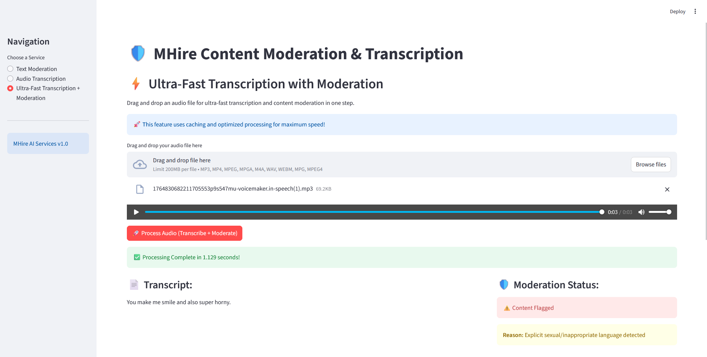

# MHire Content Moderation & Transcription API
 
 
 
 
 
 


A FastAPI-based content moderation and audio transcription service designed for dating applications. This project provides robust text moderation and audio transcription capabilities with OpenAI integration.

<p align="center">
  
</p>

## 🚀 Features

### 1. **Text Moderation**
- **Hybrid Moderation System**: Combines custom pattern detection with OpenAI's moderation API
- **Fast Custom Pattern Detection**: Detects inappropriate content without API calls when patterns match
- **Comprehensive Pattern Coverage**:
  - Explicit sexual content
  - Suggestive context
  - Body shaming and appearance-based harassment
  - Emotional abuse and manipulation
  - Racism and hate speech
  - Transactional/sugar-dating language
  - Sexism, misogyny, and transphobia
- **Custom Thresholds**: Stricter than OpenAI defaults for dating app context

### 2. **Audio Transcription**
- **OpenAI Whisper Integration**: High-accuracy speech-to-text transcription
- **Advanced Audio Preprocessing** (with pydub):
  - Volume normalization
  - High-pass and low-pass filtering
  - Mono conversion
  - Optimal sample rate (16kHz)
- **Multiple Response Formats**: text, json, verbose_json, srt, vtt
- **Supported Audio Formats**: mp3, mp4, mpeg, mpga, m4a, wav, webm
- **Confidence Scoring**: Provides transcription confidence metrics

### 3. **Ultra-Fast Transcription with Moderation**
- **Combined Processing**: Transcribes and moderates audio in one step
- **Performance Optimizations**:
  - Intelligent caching system (1-hour TTL)
  - Fast custom pattern detection first
  - Concurrent processing support
  - Automatic cache cleanup
- **Maximum Speed**: Optimized for dating app real-time requirements

### 4. **Streamlit Web Interface**
- **User-Friendly UI**: Easy-to-use web interface for all services
- **Three Main Features**:
  - Text Moderation
  - Audio Transcription
  - Ultra-Fast Transcription + Moderation
- **Drag-and-Drop Support**: Simple file upload interface
- **Real-time Processing**: Live feedback and results display

## 📋 Prerequisites

- Python 3.8+
- OpenAI API Key
- FFmpeg (optional, for audio preprocessing with pydub)

## 🛠️ Installation

1. **Clone the repository**
   ```bash
   git clone <repository-url>
   cd kamodoc_ai
   ```

2. **Create a virtual environment**
   ```bash
   python -m venv venv
   
   # Windows
   venv\Scripts\activate
   
   # Linux/Mac
   source venv/bin/activate
   ```

3. **Install dependencies**
   ```bash
   pip install -r requirements.txt
   ```

4. **Set up environment variables**
   
   Create a `.env` file in the root directory:
   ```env
   OPENAI_API_KEY=your_openai_api_key_here
   WHISPER_MODEL_NAME=whisper-1
   ```

5. **Optional: Install FFmpeg for audio preprocessing**
   - **Windows**: Download from [ffmpeg.org](https://ffmpeg.org/download.html)
   - **Linux**: `sudo apt-get install ffmpeg`
   - **Mac**: `brew install ffmpeg`

## 🚀 Running the Application

### FastAPI Server

Start the FastAPI server:

```bash
# Development mode with auto-reload
uvicorn com.mhire.app.main:app --reload --host 0.0.0.0 --port 8000

# Production mode
uvicorn com.mhire.app.main:app --host 0.0.0.0 --port 8000
```

The API will be available at:
- **API**: http://localhost:8000
- **Interactive Docs**: http://localhost:8000/docs
- **ReDoc**: http://localhost:8000/redoc

### Streamlit Web Interface

Start the Streamlit interface:

```bash
streamlit run streamlit.py
```

The web interface will open automatically at http://localhost:8501

## 📚 API Endpoints

### Health Check
```http
GET /
GET /health
```

### Text Moderation
```http
POST /moderation/moderate-text
Content-Type: application/json

{
  "text": "Your text to moderate"
}
```

**Response:**
```json
{
  "text": "Your text to moderate",
  "flagged": false,
  "reason": "Content appears safe after full analysis",
  "custom_flags": {},
  "categories": {},
  "category_scores": {}
}
```

### Simple Audio Transcription
```http
POST /transcribe/simple
Content-Type: multipart/form-data

file: <audio_file>
```

**Response:**
```json
{
  "transcript": "Transcribed text here",
  "duration_seconds": 10.5
}
```

### Ultra-Fast Transcription (No Moderation)
```http
POST /transcribe/ultra-fast
Content-Type: multipart/form-data

file: <audio_file>
```

**Response:**
```json
{
  "transcript": "Transcribed text here",
  "processing_time": 1.234
}
```

### Ultra-Fast Transcription with Moderation
```http
POST /transcribe-moderate/ultra-fast
Content-Type: multipart/form-data

file: <audio_file>
```

**Response:**
```json
{
  "transcript": "Transcribed text here",
  "safe": true,
  "flagged": false,
  "processing_time": 1.456
}
```

## 🐳 Docker Deployment

### Build the Docker image
```bash
docker build -t mhire-api .
```

### Run with Docker Compose
```bash
docker-compose up -d
```

The service will be available at http://localhost:8000

## 📁 Project Structure

```
kamodoc_ai/
├── com/
│   └── mhire/
│       └── app/
│           ├── config/
│           │   └── config.py                 # Configuration management
│           ├── services/
│           │   ├── moderation/               # Text moderation service
│           │   │   ├── moderation.py
│           │   │   ├── moderation_router.py
│           │   │   └── moderation_schema.py
│           │   ├── transcription/            # Audio transcription service
│           │   │   ├── transcription.py
│           │   │   ├── transcription_router.py
│           │   │   └── transcription_schema.py
│           │   ├── fast_transcription/       # Fast transcription (no moderation)
│           │   │   ├── fast_transcription.py
│           │   │   ├── fast_transcription_router.py
│           │   │   └── fast_transcription_schema.py
│           │   └── transcription_with_moderation/  # Combined service
│           │       ├── transcription_with_moderation.py
│           │       ├── transcription_with_moderation_router.py
│           │       └── transcription_with_moderation_schema.py
│           ├── utils/
│           │   └── moderation_utils.py       # Pattern definitions
│           └── main.py                       # FastAPI application
├── streamlit.py                              # Streamlit web interface
├── requirements.txt                          # Python dependencies
├── Dockerfile                                # Docker configuration
├── docker-compose.yml                        # Docker Compose configuration
└── README.md                                 # This file
```

## 🔧 Configuration

### Environment Variables

| Variable | Description | Default | Required |
|----------|-------------|---------|----------|
| `OPENAI_API_KEY` | OpenAI API key for Whisper and moderation | - | ✅ Yes |
| `WHISPER_MODEL_NAME` | Whisper model to use | `whisper-1` | No |

### Moderation Thresholds

Custom thresholds are defined in `com/mhire/app/services/moderation/moderation.py`:

```python
CUSTOM_THRESHOLDS = {
    "sexual": 0.05,           # 5% threshold
    "harassment": 0.05,       # 5% threshold
    "hate": 0.05,             # 5% threshold
    "violence": 0.1,          # 10% threshold
    "sexual_minors": 0.01,    # 1% threshold (very strict)
}
```

## 🎯 Use Cases

- **Dating Applications**: Moderate user messages and voice notes
- **Social Platforms**: Filter inappropriate content
- **Customer Service**: Transcribe and analyze customer calls
- **Content Platforms**: Moderate user-generated content

## 🧪 Testing

### Test Text Moderation
```bash
curl -X POST "http://localhost:8000/moderation/moderate-text" \
  -H "Content-Type: application/json" \
  -d '{"text": "Hello, how are you?"}'
```

### Test Audio Transcription
```bash
curl -X POST "http://localhost:8000/transcribe/simple" \
  -F "file=@path/to/audio.mp3"
```

### Test Ultra-Fast Processing
```bash
curl -X POST "http://localhost:8000/transcribe-moderate/ultra-fast" \
  -F "file=@path/to/audio.mp3"
```

## 📊 Performance

- **Text Moderation**: ~50-200ms (custom patterns only) or ~500-1000ms (with OpenAI)
- **Audio Transcription**: Depends on audio length (typically 1-5 seconds for short clips)
- **Ultra-Fast Processing**: Optimized with caching, ~1-3 seconds for typical voice notes
- **Cache Hit Rate**: Significantly reduces processing time for repeated content

## 🔒 Security Considerations

- Store API keys securely in environment variables
- Use HTTPS in production
- Implement rate limiting for production deployments
- Configure CORS appropriately for your domain
- Regularly update dependencies for security patches

## 🤝 Contributing

1. Fork the repository
2. Create a feature branch (`git checkout -b feature/amazing-feature`)
3. Commit your changes (`git commit -m 'Add amazing feature'`)
4. Push to the branch (`git push origin feature/amazing-feature`)
5. Open a Pull Request

## 📝 License

This project is proprietary software. All rights reserved.

## 🆘 Support

For issues, questions, or feature requests, please contact the development team.

## 🔄 Version History

- **v1.0.0** - Initial release
  - Text moderation with hybrid approach
  - Audio transcription with Whisper
  - Ultra-fast processing with caching
  - Streamlit web interface

## 🙏 Acknowledgments

- OpenAI for Whisper and Moderation APIs
- FastAPI framework
- Streamlit for the web interface
- pydub for audio preprocessing
